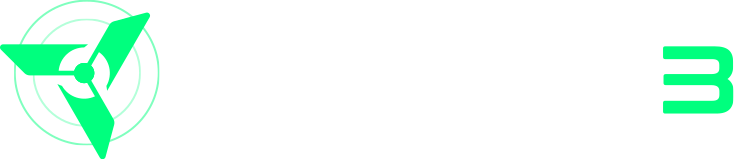

# 🚀 Turbin3 Builder Cohort 

Welcome to the **Turbin3 Builder Cohort** repository! 
This serves as a centralized hub for managing and sharing class assignments, capstone project, and resources related to the program.
I'll be documenting my whole POW throughout the program in here.

    
follow me for tech and shitposting: 
 
    

---
## 🎯 Capstone Project

## ⛳ Projects

- **[Anchor Vault Contract]()**  
  Provides secure token storage and on-chain asset management.

- **[Anchor Escrow Contract]()**  
  A contract that secures token transfers until specified conditions are met.

- **[Automated Market Maker (AMM)]()**  
  An AMM contract for managing liquidity, deposits, swaps, and withdrawals.

## Prerequisites 

- **[Rust Prerequisites]()**  
  Contains supporting Rust modules and helper functions utilized across programs.

- **[TypeScript Prerequisites]()**  
  Provides TypeScript utilities and configuration files for interacting with the on-chain programs.

## 🙏 Special Thanks

I am incredibly grateful to the entire Turbin3 team for their dedication, expertise, and commitment to nurturing the next generation of Solana developers. Their comprehensive curriculum, hands-on approach, and supportive community have been instrumental in my learning journey.

## 💡 Contributing
Feel free to contribute by opening issues or submitting pull requests to improve this repository. Let's build something great together!

---

### 🏗️ Happy Building! 👾

  

